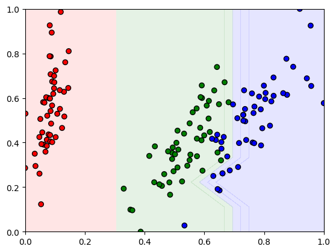
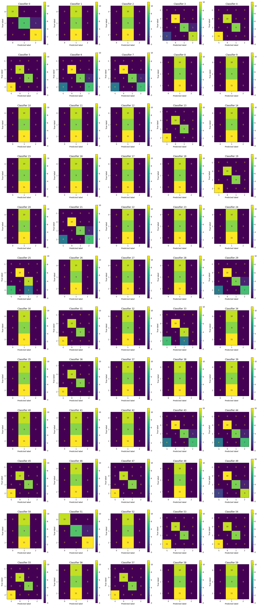

# MoFGBMLPy

## Scikit-learn

This implementation comes with a wrapper for Pittsburgh solutions, so we can use dimension reduction and other functions


### Iris with PCA dimension reduction and classification boundaries visualization (NSGA-II)


### Confusion matrices for Iris (no PCA and NSGA-II)



## Install

### Speedup pymoo

Use the compiled version of pymoo to reduce computation time

1. `pip uninstall pymoo`
2. `mkdir pymoo`
3. `cd pymoo`
4. `git clone https://github.com/anyoptimization/pymoo`
5. `cd pymoo`
6. `make compile`
7. `pip install .`
8. Check if the installation was successful: `python -c "from pymoo.util.function_loader import is_compiled;print('Compiled Extensions: ', is_compiled())"`

### If you don't need to modify the source code

If you don't need to edit the source code of this library you can just use :

`pip install git+https://github.com/RobinMeneustOMU/MoFGBML_Python`

### Dev

1. Install virtualenv if you don't already have it: `python -m pip install virtualenv`
2. Create a virtual environment: `python -m venv .venv`
3. Activate this environment: `source .venv/bin/activate` (or `".venv/Scripts/activate.bat"` on Windows)
4. Install the dependencies: `python -m pip install -r requirements.txt`
5. `python setup.py build_ext --inplace`


### Note

- Pymoo is not yet compatible with numpy 2.0.0, so we use the previous version instead
- Profiler for Cython only works for Python<3.12

## Usage

Please read the notebooks in examples/.

### Dataset

- Put your datasets in a dataset/ folder in the root of this project (where this README is)
- As in the Java version, the following format must be respected:
  - Values must be normalized (values of all numerical attributes must be between 0 and 1)
  - Categorical values must be negative

### Arguments

```
usage: ipykernel_launcher.py [-h] [--cache-size CACHE_SIZE] --experiment-id
                             EXPERIMENT_ID --algorithm-id ALGORITHM_ID
                             [--population-size POPULATION_SIZE]
                             (--terminate-generation TERMINATE_GENERATION | --terminate-evaluation TERMINATE_EVALUATION)
                             [--verbose] [--rand-seed RAND_SEED]
                             [--is-probability-dont-care]
                             [--antecedent-number-do-not-dont-care ANTECEDENT_NUMBER_DO_NOT_DONT_CARE]
                             [--dont-care-rt DONT_CARE_RT]
                             [--initiation-rule-num INITIATION_RULE_NUM]
                             [--max-num-rules MAX_NUM_RULES]
                             [--min-num-rules MIN_NUM_RULES]
                             [--antecedent-factory ANTECEDENT_FACTORY]
                             [--crossover-type CROSSOVER_TYPE]
                             [--hybrid-cross-rt HYBRID_CROSS_RT]
                             [--michigan-ope-rt MICHIGAN_OPE_RT]
                             [--rule-change-rt RULE_CHANGE_RT]
                             [--michigan-cross-rt MICHIGAN_CROSS_RT]
                             [--pittsburgh-cross-rt PITTSBURGH_CROSS_RT]
                             [--objectives OBJECTIVES [OBJECTIVES ...]]
                             [--root-folder ROOT_FOLDER] [--is-multi-label]
                             --train-file TRAIN_FILE --test-file TEST_FILE
                             --data-name DATA_NAME [--gen-plot]
                             [--no-output-files] [--pretty-xml]
                             [--offspring-population-size OFFSPRING_POPULATION_SIZE]

options:
  -h, --help            show this help message and exit
  --cache-size CACHE_SIZE
                        Third argument has been left for test purposes but
                        it's not recommended to use it since the hashing
                        function has collisions. Cache size for fitness values
                        computation. A big cache might deteriorate performance
                        and increase RAM usage
  --experiment-id EXPERIMENT_ID
                        Experiment ID (Used to create the path where results
                        are saved)
  --algorithm-id ALGORITHM_ID
                        Algorithm ID (Used to create the path where results
                        are saved)
  --population-size POPULATION_SIZE
                        Population size (Number of individuals per generation)
  --terminate-generation TERMINATE_GENERATION
                        Set the termination criterion to the number of
                        generation, and set the max value
  --terminate-evaluation TERMINATE_EVALUATION
                        Set the termination criterion to the number of
                        objective function evaluations, and set the max value
  --verbose             If True then display for each generation some
                        information
  --rand-seed RAND_SEED
                        The seed for random operations
  --is-probability-dont-care
                        If specified then use the don't care rate for the
                        antecedent factory, otherwise compute it from
                        antecedent num not don't care
  --antecedent-number-do-not-dont-care ANTECEDENT_NUMBER_DO_NOT_DONT_CARE
                        Number of indices that are not 0 (which is don't care)
                        in an antecedent. Used by the antecedent factory
  --dont-care-rt DONT_CARE_RT
                        Don't care probability for antecedent indices in
                        antecedent factory
  --initiation-rule-num INITIATION_RULE_NUM
                        Number of rules in Pittsburgh solutions in the initial
                        population
  --max-num-rules MAX_NUM_RULES
                        Maximum number of rules in Pittsburgh solutions
  --min-num-rules MIN_NUM_RULES
                        Minimum number of rules in Pittsburgh solutions
  --antecedent-factory ANTECEDENT_FACTORY
                        Antecedent factory used for fuzzy rule generation. If
                        crossover-type is hybrid then
  --crossover-type CROSSOVER_TYPE
                        Crossover used in the GA algorithm
  --hybrid-cross-rt HYBRID_CROSS_RT
                        Probability that a (hybrid) crossover occurs
  --michigan-ope-rt MICHIGAN_OPE_RT
                        Probability that Michigan mating operators are used
                        instead of a Pittsburgh one
  --rule-change-rt RULE_CHANGE_RT
                        Ratio of the rules that are changed in a Michigan
                        crossover
  --michigan-cross-rt MICHIGAN_CROSS_RT
                        Probability that a Michigan crossover occurs
  --pittsburgh-cross-rt PITTSBURGH_CROSS_RT
                        Probability that a Pittsburgh crossover occurs
  --objectives OBJECTIVES [OBJECTIVES ...]
                        List of the objectives. Accepted values: 'error-rate',
                        'rule-interpretation', 'num-rules', 'total-rule-length
  --root-folder ROOT_FOLDER
                        Path where results are saved
  --is-multi-label      Must be specified if the dataset is a multi label one
                        and not specified otherwise, which is the default
  --train-file TRAIN_FILE
                        Path of the training dataset file
  --test-file TEST_FILE
                        Path of the test dataset file
  --data-name DATA_NAME
                        Dataset name. It's used to create the path where
                        results are saved
  --gen-plot            Generate matplotlib plots
  --no-output-files     Don't save results in files (plots, solutions,
                        arguments...)
  --pretty-xml          Save results in a pretty XML file (formated with
                        indentation)
  --offspring-population-size OFFSPRING_POPULATION_SIZE
                        Number of offsprings generated per generation
```

## Profiling

### Automatically

Run `python profiler.py MoFGBMLNSGAIIMain` (or replace MoFGBMLNSGAIIMain with the method you want to use)

### Manually

1. Install `gprof2dot`
2. Generate a pstats profiler results file
3. `gprof2dot -f pstats Profile.pstats -o Profile.dot`
4. `dot Profile.dot -Tpng -o Profile.png`


## Documentation

### Requirements (NOT in requirements.txt)

- sphinx
- myst_parser
- rst2pdf
- sphinx-mdinclude
- sphinx_rtd_theme


`pip install sphinx myst_parser rst2pdf sphinx-mdinclude sphinx_rtd_theme`

### Generation

#### Setup

1. Generate the rst files from the code: `sphinx-apidoc -o docs/source/ src/mofgbmlpy`
2. Generate the documentation from the rst files 
   - In HTML: `docs/make.bat html`
   - In PDF: `docs/make.bat pdf`
3. Open the documentation:
   - HTML: Open `docs/_build/html/index.html`
   - PDF: Open `docs/_build/pdf/MoFGBMLPy.pdf`
