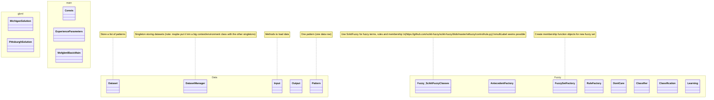

```mermaid
classDiagram
    note for Dataset "Store a list of patterns"
    note for DatasetManager "Singleton storing datasets (note: maybe put it \nin a big context/environment class with the other singletons)"
    note for Input "Methods to load data"
    note for Pattern "One pattern (one data row)"
namespace Data {    
    class Dataset {
        
    }
    
    class DatasetManager {
        
    }
    
    class Input {
        
    }
    
    class Output {
        
    }
    
    class Pattern {
        
    }
}

note for Fuzzy_ScikitFuzzyClasses "Use SckitFuzzy for fuzzy terms, rules and membership \n(https://github.com/scikit-fuzzy/scikit-fuzzy/blob/master/skfuzzy/control/rule.py):\nmultiLabel seems possible"
note for FuzzySetFactory "Create membership function objects for new fuzzy set"
namespace Fuzzy {
    class Fuzzy_ScikitFuzzyClasses {
        
    }
    
    class AntecedentFactory {
        
    }
    
    class FuzzySetFactory {
        
    }
    
    class RuleFactory {
        
    }
    
    class DontCare {
        
    }
    
    class Classifier {
        
    }
    
    class Classification {
        
    }
    
    class Learning {
        
    }
}

namespace gbml {
    class MichiganSolution {
        
    }
    
    class PittsburghSolution {
        
    }
}

namespace main {
    class Consts {
        
    }
    
    class ExperienceParameters {
        
    }
    
    class MofgbmlBasicMain {
        
    }
}

```