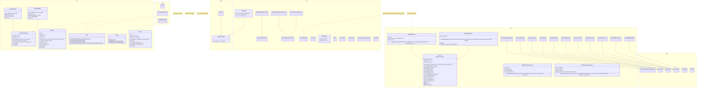

```mermaid
classDiagram
    note for Dataset "Store a list of patterns"
%%    note for DatasetManager "Singleton storing datasets (note: maybe put it \nin a big context/environment class with the other singletons)"
    note for Input "Methods to load data"
    note for Pattern "One pattern (one data row)"
    
    ClassLabelBasic --|> AbstractClassLabel
    ClassLabelMulti --|> AbstractClassLabel
    
    namespace data {
        class Dataset {
            -size : int
            -num_dim : int
            -num_classes : int
            -patterns : List<Pattern>
            
            +Dataset(int size, int n_dim, int c_num, List~Pattern~ patterns)
            +get_pattern(int index) Pattern
            +get_patterns() List<Pattern>
            +get_num_dim() int
            +get_num_classes() int
            +get_size() int
            +__str__() String
        }

        class Input { 
            +input_data_set(String file_name, bool is_multi_label)$
            +input_data_set_multi(String file_name)$
            +input_data_set_basic(String file_name)$
            +get_train_test_files(String train_file_name, String test_file_name, bool is_multi_label)$
        }

        class Output { 
            +mkdirs(dir_name)$
            +writeln(file_name, txt, append=False)$
            +writelns(file_name, lns, append=False)$
        }

        class Pattern {
            -id : int
            -attribute_vector : List<float>
            -target_class : ClassLabel
        
            +Pattern(pattern_id, attribute_vector, target_class)
            +get_id() int
            +get_attributes_vector() List<float>
            +get_attribute_value(int index) float
            +get_target_class() ClassLabel
            +__str__() String
        }
        
%%        class_label
        class AbstractClassLabel {
            #class_label : int/List<int>
            -is_rejected : bool
            
            +AbstractClassLabel(int/List~int~ class_label)
            +get_class_label_value() int/List~int~
            +set_class_label_value(int/List~int~ class_label)
            +is_rejected()
            +set_rejected()
        }
        
        class ClassLabelBasic {
                ClassLabelBasic(int class_label)
                __eq__(object other) bool
                copy() ClassLabelBasic
                __str__() String
        }
        
        class ClassLabelMulti {
            ClassLabelBasic(List~int~ class_label)
            get_length() int
            __eq__(ClassLabelMulti other) bool
            copy() ClassLabelMulti
            __str__() String
        }
    }

    note for FuzzySetFactory "Create membership function objects for new fuzzy set"
    Knowledge --o "*" LinguisticVariable
    FuzzySet --o "*" LinguisticVariable

    namespace simpful {
        class LinguisticVariable {
            +get_values(float v) List~float~
        }

        class FuzzySet {
        }
    }

    SingleWinnerRuleSelection --|> AbstractClassification
    AllCombinationAntecedentFactory --|> AbstractAntecedentFactory
    HeuristicAntecedentFactory --|> AbstractAntecedentFactory

    namespace fuzzy {
    %%    knowledge
        class Knowledge {
            -fuzzy_sets: List~LinguisticVariable~
            -fuzzy_sets_lengths: List~int~
        }

    %%    fuzzy_term
        class FuzzySetFactory {
        }

        class DontCare {
        }

    %%    rule
        class RuleFactory {
            -antecedent_factory
            -consequent_factory
        }

        class Rule {
        }

    %%          rule.antecedent
        class Antecedent {
        }

        class AbstractAntecedentFactory {
        }

        class AllCombinationAntecedentFactory {
        }

        class HeuristicAntecedentFactory {
        }

    %%          rule.consequent

        class Consequent {
        }

        class AbstractConsequentFactory {
        }

    %%    classifier

        class Classifier {
        }

        class AbstractClassification {
        }

        class SingleWinnerRuleSelection {
        }
    }

    BasicDuplicateElimination --|> ElementwiseDuplicateElimination
    MichiganSolution --|> AbstractSolution~T~
    PittsburghSolution --|> AbstractSolution
    PittsburghProblem --|> Problem
    MichiganProblem --|> Problem
    BasicMutation --|> Mutation
    MichiganMutation --|> Mutation
    PittsburghMutation --|> Mutation
    UniformCrossover --|> Crossover
    MichiganCrossover --|> Crossover
    PittsburghCrossover --|> Crossover
    HybridGBMLCrossover --|> Crossover
    HybridGBMLSampling --|> Sampling
    note for MichiganSolution "bounds is a pair of int"

    namespace gbml {
        class BasicDuplicateElimination {
        }

    %%    solution
        class AbstractSolution~T~ {
            <<abstract>>
            -objectives: List~float~
            -variables: List~T~
            -constraints: List~float~
            +Solution(int num_variables, int num_objectives, int num_constraints=0)
            +set_objective(int index, float value)
            +get_objective(int index) float
            +get_objectives() float
            +set_variable(int index)
            +get_variable(int index) T
            +get_variables() List~T~
            +set_constraint(int index, float value)
            +get_constraint(int index) float
            +get_constraints() float
            +get_num_variables() int
            +get_num_objectives() int
            +get_num_constraints() int
            +__eq__(other) bool
            +__hash__() int
            +__copy__() Solution~T~
        }

        class MichiganSolution {
            -rule: Rule
            -consequent_factory: ConsequentFactory
            -bounds: tuple
            +MichiganSolution(tuple bounds, int num_objectives, int num_constraints, ConsequentFactory consequent_factory)
        }

        class MichiganSolutionFactory {
            -bounds: tuple
            -num_objectives: int
            -num_constraints: int
            -rule_factory: RuleFactory
            +MichiganSolutionFactory(tuple bounds, int num_objectives, int num_constraints, RuleFactory rule_factory)
        }

        class PittsburghSolution {
            -classifier: Classifier
            +PittsburghSolution(int num_variables, int num_objectives, int num_constraints, ConsequentFactory consequent_factory, Classifier classifier)
        %%        learning() update the consequent part of each rule
            +learning()
            +classifiy(Pattern pattern) MichiganSolution
            +
        }

        class PittsburghSolutionFactory {
            -classifier: Classifier
            -num_objectives: int
            -num_constraints: int
            -michigan_solution_factory: MichiganSolutionFactory
            +MichiganSolutionFactory(int num_variables, int variables, int num_objectives, int num_constraints, MichiganSolutionFactory michigan_solution_factory)
        }

    %%    operator

    %%          crossover
        class UniformCrossover {
        }

        class MichiganCrossover {
        }

        class PittsburghCrossover {
        }

        class HybridGBMLCrossover {
        }

    %%    mutation
    %%TEMPORARY CLASS
        class BasicMutation {
        }

        class MichiganMutation {
        }

        class PittsburghMutation {
        }

    %%    problem
        class PittsburghProblem {
        }

        class MichiganProblem {
        }

    %%    sampling
        class HybridGBMLSampling {
        }
    }

    namespace main {
        class Consts {
        }

        class ExperienceParameters {
        }

        class MofgbmlBasicMain {
        }
    }

    namespace pymoo {
        class Problem {
        }
        class Crossover {
        }
        class Mutation {
        }
        class Sampling {
        }
        class ElementwiseDuplicateElimination {
        }
        class NSGA2 {
        }
    }

```