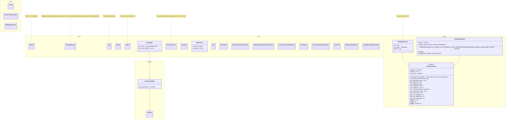

```mermaid
classDiagram
    note for Dataset "Store a list of patterns"
    note for DatasetManager "Singleton storing datasets (note: maybe put it \nin a big context/environment class with the other singletons)"
    note for Input "Methods to load data"
    note for Pattern "One pattern (one data row)"
    
namespace data {    
    class Dataset {
        
    }
    
    class DatasetManager {
        
    }
    
    class Input {
        
    }
    
    class Output {
        
    }
    
    class Pattern {
        
    }
}

note for FuzzySetFactory "Create membership function objects for new fuzzy set"

Knowledge o--> "*" LinguisticVariable
LinguisticVariable o--> "*" FuzzySet

namespace simpful {
    class LinguisticVariable {
        +get_values(float v) List~float~
    }
    
    class FuzzySet { }
}

namespace fuzzy {
%%    knowledge
    class Knowledge {
        -fuzzy_sets : List~LinguisticVariable~
        -fuzzy_sets_lengths : List~int~
    }

%%    fuzzy_term
    class FuzzySetFactory { }
    
    class DontCare { }
    
%%    rule
    class RuleFactory {
        -antecedent_factory
        -consequent_factory
    }
    
    class Rule { }
    
%%          rule.antecedent
    class Antecedent { }
    
    class AbstractAntecedentFactory { }
    
    class AllCombinationAntecedentFactory { }
    
    class HeuristicAntecedentFactory { }
    
%%          rule.consequent
    
    class Consequent { }
    
    class AbstractConsequentFactory { }
    
%%    classifier
    
    class Classifier { }
    
    class AbstractClassification { }
    
    class SingleWinnerRuleSelection { }
}

MichiganSolution --|> AbstractSolution
PittsburghSolution --|> AbstractSolution
note for MichiganSolution "bounds is a pair of int"

namespace gbml {
    class AbstractSolution~T~ {
        <<abstract>>
        -objectives : List~float~
        -variables : List~T~
        -constraints : List~float~
        
        +Solution(int num_variables, int num_objectives, int num_constraints=0)
        
        +set_objective(int index, float value)
        +get_objective(int index) float
        +get_objectives() float
        
        +set_variable(int index)
        +get_variable(int index) T
        +get_variables() List~T~
        
        +set_constraint(int index, float value)
        +get_constraint(int index) float
        +get_constraints() float
        
        +get_num_variables() int
        +get_num_objectives() int
        +get_num_constraints() int
        
        +__eq__(other) bool
        +__hash__() int
        +__copy__() Solution~T~
    }
    
    class MichiganSolution {
        -rule : Rule
        -rule_builder : RuleBuilder
        -bounds : tuple
    }
    
    class PittsburghSolution {
        -classifier : Classifier
        -michigan_solution_builder : MichiganSolutionBuilder
%%        No need for training set, it's already in the rule builder in michigan solution builder
        
        +PittsburghSolution(int num_variables, int num_objectives, int num_constraints, MichiganSolutionBuilder michigan_solution_builder, Classifier classifier)
%%        learning() update the consequent part of each rule
        +learning()
        +classifiy(Pattern pattern) MichiganSolution
    }
}

namespace main {
    class Consts {
        
    }
    
    class ExperienceParameters {
        
    }
    
    class MofgbmlBasicMain {
        
    }
}

```